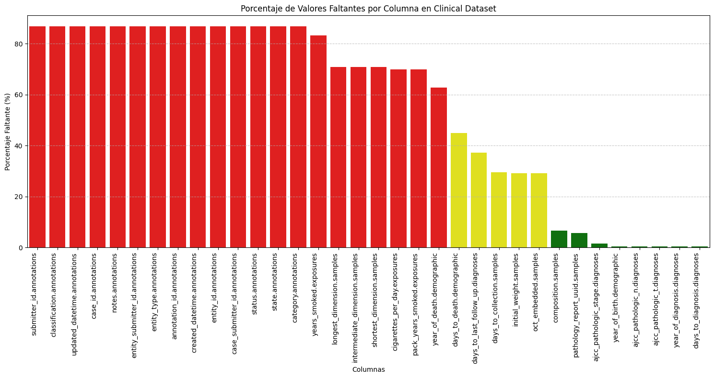
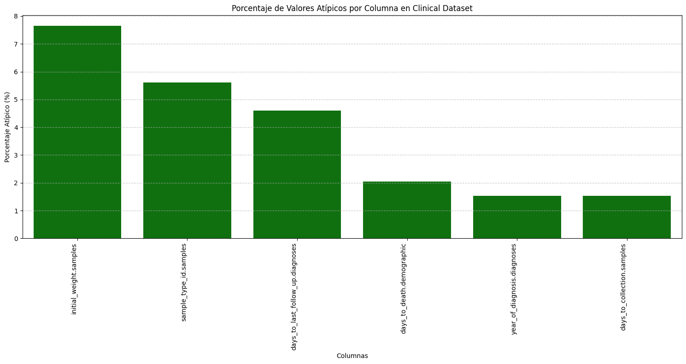

# 2. Exploración y Preprocesamiento de Datos

[← Planteamiento](01_planteamiento.md) | [Siguiente: PCA →](03_pca.md)

---

## Importar Datos

Se importaron los tres datasets principales desde Google Drive en formato `.tsv.gz`:

```python
import pandas as pd
import gzip

clinical = pd.read_csv('/content/drive/MyDrive/Inteligencia_Artificial_1/Proyecto 3/TCGA-PAAD.clinical.tsv.gz',
                       sep='\t', on_bad_lines='skip')
tpm      = pd.read_csv('/content/drive/MyDrive/Inteligencia_Artificial_1/Proyecto 3/TCGA-PAAD.star_tpm.tsv.gz',
                       sep='\t', on_bad_lines='skip')
survival = pd.read_csv('/content/drive/MyDrive/Inteligencia_Artificial_1/Proyecto 3/TCGA-PAAD.survival.tsv.gz',
                       sep='\t', on_bad_lines='skip')
```

### Dimensiones de cada dataset

```python
clinical.shape   # (196, 89)
tpm.shape        # (60660, 184)
survival.shape   # (195, 4)
```

- **Clinical:** 196 muestras × 89 variables clínicas
- **TPM:** 60,660 genes × 184 columnas (muestras). El dataset más extenso — requiere reducción de dimensionalidad.
- **Survival:** 195 observaciones × 4 variables. Bastante simple para empezar.

---

## Búsqueda de Valores Faltantes

Con el fin de tener una mejor comprensión de los datos, se buscaron valores faltantes, valores atípicos y se revisaron las distribuciones del dataset clínico.

```python
import matplotlib.pyplot as plt
import seaborn as sns

missing_percentages = clinical.isnull().sum() / len(clinical) * 100
missing_data = missing_percentages[missing_percentages > 0].sort_values(ascending=False)
missing_df = missing_data.to_frame(name='Missing Percentage')

def get_bar_color(percentage):
    if percentage < 20:   return 'green'
    elif percentage < 50: return 'yellow'
    else:                 return 'red'

colors = [get_bar_color(p) for p in missing_df['Missing Percentage']]

plt.figure(figsize=(15, 8))
sns.barplot(x=missing_df.index, y='Missing Percentage', data=missing_df, palette=colors)
plt.title('Porcentaje de Valores Faltantes por Columna en Clinical Dataset')
plt.xlabel('Columnas')
plt.ylabel('Porcentaje Faltante (%)')
plt.xticks(rotation=90, ha='right')
plt.grid(axis='y', linestyle='--', alpha=0.7)
plt.tight_layout()
plt.show()
```
---



---

El criterio utilizado para eliminar columnas fue: **se elimina cualquier variable con más del 45% de valores faltantes** (umbral establecido a partir de la variable `days_to_death.demographic`). Por encima de ese porcentaje, completar los datos implicaría esencialmente inventarlos, lo cual no es el enfoque de este análisis.

```python
columns_to_drop = missing_percentages[missing_percentages > 45].index
print(f"Columns to be dropped: {len(columns_to_drop)}")

clinical_filtered = clinical.drop(columns=columns_to_drop)
# Original shape: (196, 89)  →  New shape: (196, ~68)
clinical = clinical_filtered
```

Se eliminaron aproximadamente **21 variables** con datos insuficientes.

---

## Búsqueda de Valores Atípicos

Para buscar valores atípicos se utilizó el **método de Tukey**, donde el rango intercuartil se define como `IQR = Q3 - Q1`. Los valores fuera del rango `[Q1 - 1.5·IQR, Q3 + 1.5·IQR]` se consideran atípicos.

```python
numerical_cols = clinical.select_dtypes(include=['float64', 'int64']).columns
outlier_percentages = {}

for col in numerical_cols:
    Q1 = clinical[col].quantile(0.25)
    Q3 = clinical[col].quantile(0.75)
    IQR = Q3 - Q1
    lower_bound = Q1 - 1.5 * IQR
    upper_bound = Q3 + 1.5 * IQR
    outliers = clinical[(clinical[col] < lower_bound) | (clinical[col] > upper_bound)]
    outlier_percentage = (len(outliers) / len(clinical)) * 100
    if outlier_percentage > 0:
        outlier_percentages[col] = outlier_percentage

outlier_df = pd.DataFrame(outlier_percentages.items(),
                           columns=['Column', 'Outlier Percentage']
                          ).sort_values(by='Outlier Percentage', ascending=False)

plt.figure(figsize=(15, 8))
sns.barplot(x='Column', y='Outlier Percentage', data=outlier_df, palette=colors_outliers)
plt.title('Porcentaje de Valores Atípicos por Columna en Clinical Dataset')
plt.xticks(rotation=90, ha='right')
plt.tight_layout()
plt.show()
```

---

---

```python
# Porcentaje global de outliers en el dataset
overall_outlier_percentage = (total_outlier_entries / num_numerical_cells) * 100
# Resultado: ~2.00%
```

Solo el **2% de los datos son valores atípicos**. Dado que estamos trabajando con datos genéticos y no somos expertos en el dominio, se optó por **conservarlos**. La genética es extremadamente variable: un valor fuera del rango estándar puede ser un error de captura o simplemente la expresión natural de un fenotipo particular. Sin certeza de cuál es el caso, lo más honesto es dejarlo como está.

---

## Transformación de Variables

El objetivo es convertir las variables categóricas (tipo objeto) en variables numéricas para poder aplicar los algoritmos de clustering. En aprendizaje no supervisado esto se puede hacer sin tanta preocupación por la fuga de datos, ya que precisamente queremos que el modelo encuentre patrones y agrupe.

### Paso 1: Separar identificadores

Primero se movieron las columnas que son puramente identificadores a un DataFrame aparte (`clinical_identifiers`), ya que al aplicar One-Hot Encoding generarían una columna única por cada valor, lo cual no aporta información real al modelo.

```python
identifier_cols_to_exclude = [
    'pathology_report_uuid.samples', 'sample_id.samples',
    'created_datetime.treatments.diagnoses', 'submitter_id.treatments.diagnoses',
    'treatment_id.treatments.diagnoses', 'updated_datetime.treatments.diagnoses',
    'name.tissue_source_site', 'code.tissue_source_site',
    'tissue_source_site_id.tissue_source_site', 'project_id.project',
    'primary_site.project', 'case_id', 'id', 'submitter_id'
]

clinical_identifiers = clinical[identifier_cols_to_exclude].copy()
clinical = clinical.drop(columns=identifier_cols_to_exclude)
```

Se conservó la columna `sample` (sin OHE) ya que servirá como llave para relacionar los datos clínicos con los datos genómicos.

### Paso 2: One-Hot Encoding

```python
categorical_cols_for_ohe = [col for col in categorical_cols if col != 'sample']
clinical_encoded = pd.get_dummies(clinical, columns=categorical_cols_for_ohe, drop_first=False)
clinical = clinical_encoded
```

### Paso 3: Eliminar columnas constantes

Se identificaron columnas que al ser codificadas generaron una sola categoría constante (variables con un único valor único en todo el dataset). Estas no aportan información discriminativa y se eliminaron.

### Paso 4: Conversión de booleanos y limpieza final

```python
for col in clinical.select_dtypes(include=['bool']).columns:
    clinical[col] = clinical[col].astype(int)

columns_to_drop_further = [
    'days_to_birth.demographic',
    'days_to_diagnosis.diagnoses',
    'age_at_diagnosis.diagnoses',
    'age_at_earliest_diagnosis.diagnoses.xena_derived'
]
clinical = clinical.drop(columns=columns_to_drop_further, errors='ignore')
```

### Resultado final

El dataset clínico quedó con **106 columnas numéricas** y **1 columna de identificador** (`sample`). Está listo para integrarse con los datos genómicos.

---

[← Planteamiento](01_planteamiento.md) | [Siguiente: PCA →](03_pca.md)
