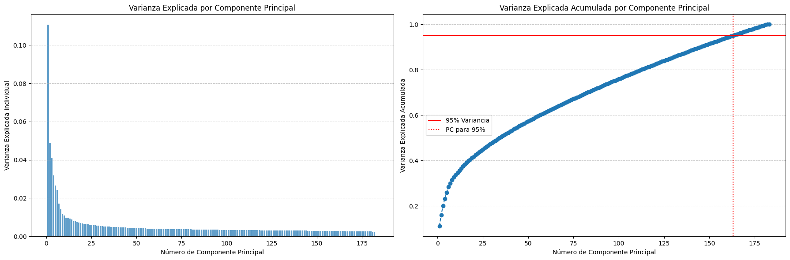
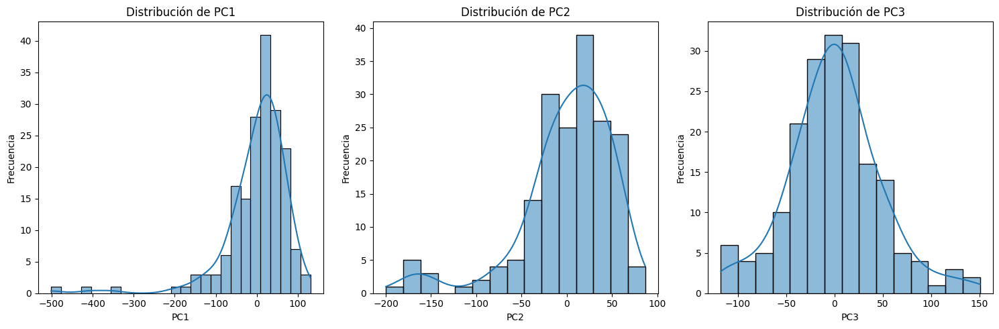
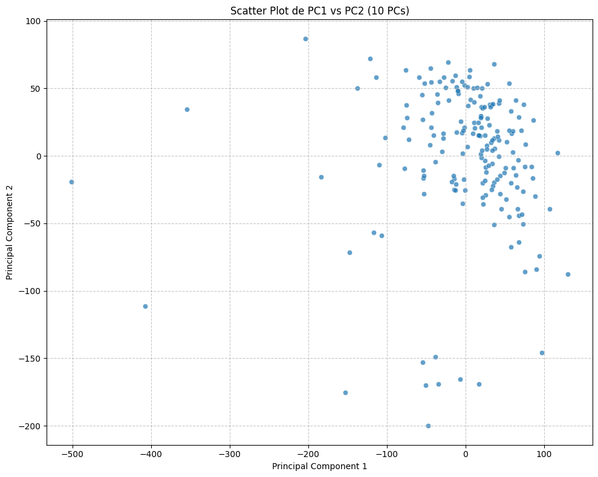

# 3. Reducción de Dimensionalidad — PCA

[← Preprocesamiento](02_preprocesamiento.md) | [Siguiente: K-Means →](04_kmeans.md)

---

## Contexto

El dataset de expresión génica (`tpm`) cuenta con **60,660 genes × 184 muestras**. Trabajar directamente con esa dimensionalidad es computacionalmente costoso e introduce ruido. Se aplicó **Análisis de Componentes Principales (PCA)** para reducir el espacio de características a una representación más compacta.

---

## Preparación del Dataset TPM

Antes de aplicar PCA, se realizaron los siguientes pasos de preparación:

1. Establecer `Ensembl_ID` como índice (identificador de gen).
2. **Transponer** el DataFrame para que las filas sean muestras y las columnas sean genes — formato requerido por PCA.
3. Aplicar **transformación logarítmica** `log2(TPM + 0.001)` para normalizar la distribución de los valores de expresión. El pequeño desplazamiento de 0.001 evita `log(0)`.

```python
import numpy as np
from sklearn.preprocessing import StandardScaler
from sklearn.decomposition import PCA

tpm_processed = tpm.copy()
tpm_processed = tpm_processed.set_index('Ensembl_ID')
tpm_processed = tpm_processed.T                          # muestras × genes
tpm_processed = np.log2(tpm_processed + 0.001)

print("Shape después del procesamiento:", tpm_processed.shape)
# → (183, 60660)
```

---

## Estandarización

PCA es sensible a la escala: genes con mayor varianza dominarían los componentes principales. `StandardScaler` transforma cada gen para que tenga **media = 0** y **varianza = 1**.

```python
scaler = StandardScaler()
tpm_scaled = scaler.fit_transform(tpm_processed)

tpm_scaled_df = pd.DataFrame(tpm_scaled,
                              index=tpm_processed.index,
                              columns=tpm_processed.columns)

print("Shape de datos estandarizados:", tpm_scaled_df.shape)
# → (183, 60660)
```

---

## Aplicación de PCA y Varianza Explicada

Se ejecutó PCA sin restringir el número de componentes para analizar primero cuántos son necesarios para capturar la información relevante.

```python
pca = PCA()
pca.fit(tpm_scaled)

explained_variance_ratio = pca.explained_variance_ratio_
cumulative_explained_variance = np.cumsum(explained_variance_ratio)

# Gráficas
plt.figure(figsize=(18, 6))

plt.subplot(1, 2, 1)
plt.bar(range(1, len(explained_variance_ratio) + 1), explained_variance_ratio, alpha=0.7)
plt.xlabel('Número de Componente Principal')
plt.ylabel('Varianza Explicada Individual')
plt.title('Varianza Explicada por Componente Principal')

plt.subplot(1, 2, 2)
plt.plot(range(1, len(cumulative_explained_variance) + 1),
         cumulative_explained_variance, marker='o', linestyle='--')
plt.axhline(y=0.95, color='r', linestyle='-', label='95% Varianza')
plt.axvline(x=np.argmax(cumulative_explained_variance >= 0.95) + 1,
            color='r', linestyle=':')
plt.title('Varianza Explicada Acumulada')
plt.legend()
plt.tight_layout()
plt.show()

num_components_95 = np.argmax(cumulative_explained_variance >= 0.95) + 1
print(f"PCs para explicar el 95% de la varianza: {num_components_95}")
# → 163
```

---



---

Se necesitarían **163 PCs** para explicar el 95% de la varianza total. Sin embargo, la gráfica del codo muestra que la varianza individual explicada se estabiliza alrededor del **décimo componente**. Se optó por reducir a **10 PCs** como balance entre compacidad y representatividad.

---

## Distribución de los Primeros Componentes Principales

```python
tpm_pca = pca.transform(tpm_scaled)
pca_df = pd.DataFrame(data=tpm_pca,
                      index=tpm_processed.index,
                      columns=[f'PC{i+1}' for i in range(tpm_pca.shape[1])])

plt.figure(figsize=(15, 5))
for i in range(3):
    plt.subplot(1, 3, i + 1)
    sns.histplot(pca_df[f'PC{i+1}'], kde=True)
    plt.title(f'Distribución de PC{i+1}')
plt.tight_layout()
plt.show()
```

---



---

## Reducción Final a 10 Componentes Principales

```python
pca_10_components = PCA(n_components=10)
tpm_pca_10 = pca_10_components.fit_transform(tpm_scaled)

pca_df_10 = pd.DataFrame(data=tpm_pca_10,
                          index=tpm_processed.index,
                          columns=[f'PC{i+1}' for i in range(10)])

print("Shape final:", pca_df_10.shape)
# → (183, 10)
```

### Visualización de PC1 vs PC2

```python
plt.figure(figsize=(10, 8))
sns.scatterplot(x='PC1', y='PC2', data=pca_df_10, alpha=0.7)
plt.xlabel('Principal Component 1')
plt.ylabel('Principal Component 2')
plt.title('Scatter Plot de PC1 vs PC2 (10 PCs)')
plt.grid(True, linestyle='--', alpha=0.7)
plt.tight_layout()
plt.show()
```

---



---

Se observa una acumulación de los datos en el scatter PCA. Probemos con los modelos para ver qué tal nos va agrupando.

---

[← Preprocesamiento](02_preprocesamiento.md) | [Siguiente: K-Means →](04_kmeans.md)
