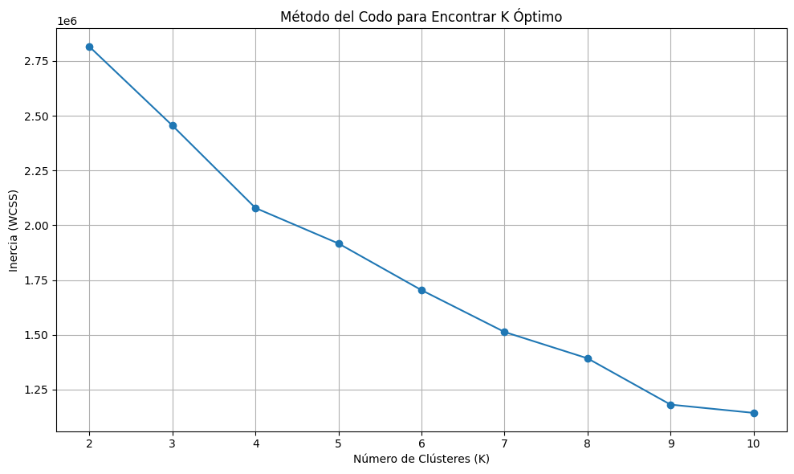
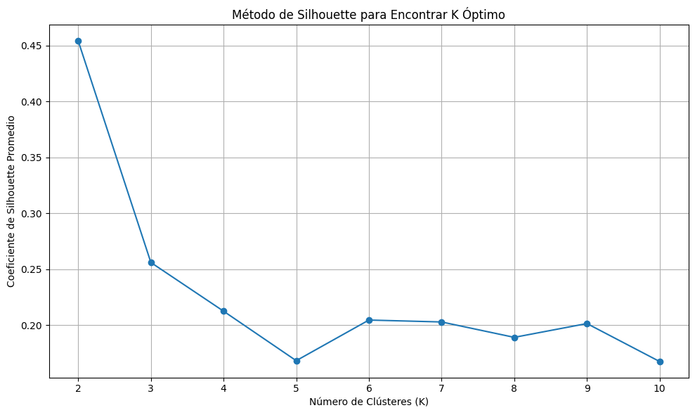
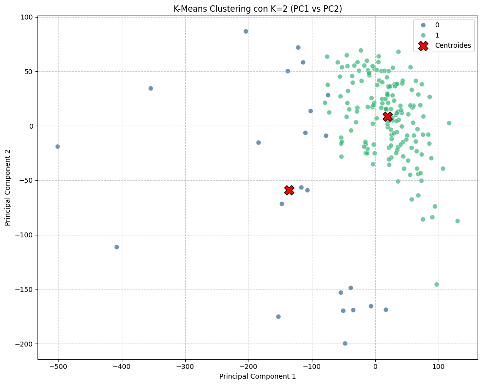
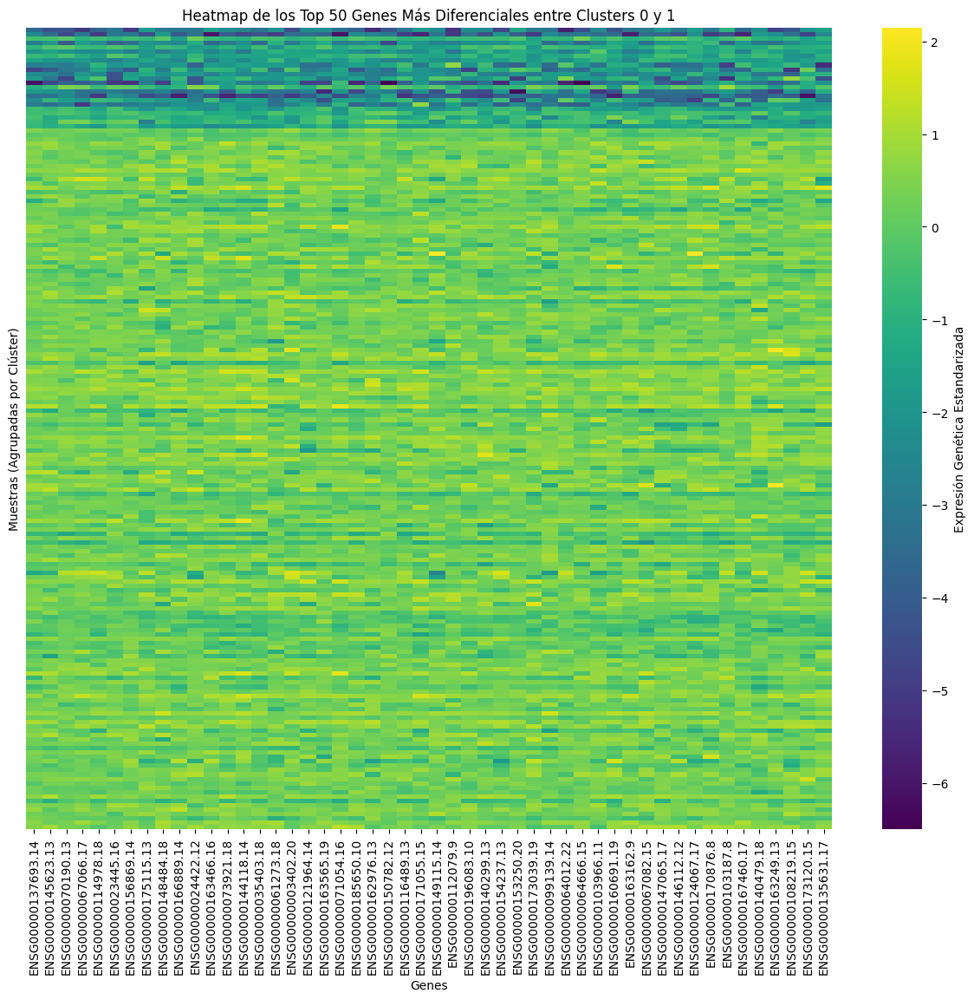

# 4. K-Means Clustering

[← PCA](03_pca.md) | [Siguiente: Clustering Jerárquico →](05_jerarquico.md)

---

## Determinación del Número Óptimo de Clusters (K)

Seleccionar el número adecuado de clusters $K$ es un paso crucial. Se utilizaron dos métodos:

**Método del Codo (Elbow Method):** Grafica la inercia (suma de distancias cuadradas de cada punto a su centroide) para diferentes valores de $K$. Se busca el "codo" donde la mejora se vuelve marginal.

**Coeficiente de Silhouette:** Mide qué tan similar es un punto a su propio cluster comparado con otros clusters. Valores cercanos a 1 indican clusters bien definidos; valores negativos indican asignación incorrecta.

```python
from sklearn.cluster import KMeans
from sklearn.metrics import silhouette_score

k_range = range(2, 11)

# --- Método del Codo ---
inertia = []
for k in k_range:
    kmeans = KMeans(n_clusters=k, random_state=42, n_init=10)
    kmeans.fit(pca_df_10)
    inertia.append(kmeans.inertia_)

plt.figure(figsize=(10, 6))
plt.plot(k_range, inertia, marker='o')
plt.title('Método del Codo para Encontrar K Óptimo')
plt.xlabel('Número de Clústeres (K)')
plt.ylabel('Inercia (WCSS)')
plt.xticks(list(k_range))
plt.grid(True)
plt.tight_layout()
plt.show()
```

---



---

```python
# --- Silhouette ---
silhouette_scores = []
for k in k_range:
    kmeans = KMeans(n_clusters=k, random_state=42, n_init=10)
    kmeans.fit(pca_df_10)
    score = silhouette_score(pca_df_10, kmeans.labels_)
    silhouette_scores.append(score)

plt.figure(figsize=(10, 6))
plt.plot(k_range, silhouette_scores, marker='o')
plt.title('Método de Silhouette para Encontrar K Óptimo')
plt.xlabel('Número de Clústeres (K)')
plt.ylabel('Coeficiente de Silhouette Promedio')
plt.xticks(list(k_range))
plt.grid(True)
plt.tight_layout()
plt.show()

for k, score in zip(k_range, silhouette_scores):
    print(f"K = {k}: Silhouette = {score:.4f}")
```

---



---

**Resultado:** El valor más alto de Silhouette corresponde a **K = 2**, que será el número de clusters utilizado.

---

## K-Means con K = 2

```python
k_optimal = 2
kmeans_final = KMeans(n_clusters=k_optimal, random_state=42, n_init=10)
kmeans_final.fit(pca_df_10)

cluster_labels = kmeans_final.labels_
final_centroids = kmeans_final.cluster_centers_

plt.figure(figsize=(10, 8))
sns.scatterplot(x='PC1', y='PC2', hue=cluster_labels,
                palette='viridis', data=pca_df_10,
                legend='full', s=50, alpha=0.7)
plt.scatter(final_centroids[:, 0], final_centroids[:, 1],
            marker='X', s=200, color='red', label='Centroides', edgecolors='black')
plt.title(f'K-Means Clustering con K={k_optimal} (PC1 vs PC2)')
plt.xlabel('Principal Component 1')
plt.ylabel('Principal Component 2')
plt.grid(True, linestyle='--', alpha=0.7)
plt.legend()
plt.tight_layout()
plt.show()
```

---



---

## Evaluación de la Calidad del Clustering

```python
silhouette_avg = silhouette_score(pca_df_10, cluster_labels)
final_inertia = kmeans_final.inertia_

print(f"Coeficiente de Silhouette para K={k_optimal}: {silhouette_avg:.4f}")
print(f"Inercia (WCSS) para K={k_optimal}: {final_inertia:.2f}")
```

El coeficiente de Silhouette obtenido es moderado, lo que es esperable dado el solapamiento visual observado en el PCA. Un Silhouette perfecto requeriría grupos claramente separados en el espacio de los componentes principales.

---

## Integración de Clusters con Datos Clínicos

Con los clusters definidos, se integró la información con el dataset clínico para poder caracterizar cada grupo en términos de variables clínicas (edad, género, estadio, supervivencia).

```python
# Agregar etiquetas de cluster al DataFrame PCA
pca_df_10['cluster'] = cluster_labels

pca_df_with_clusters = pca_df_10.reset_index()
pca_df_with_clusters = pca_df_with_clusters.rename(columns={'index': 'sample'})
pca_df_with_clusters['sample'] = pca_df_with_clusters['sample'].apply(
    lambda x: x[:-4] if x.endswith('-01A') else x
)

# Preparar clinical con el mismo formato de sample
clinical_for_merge = clinical.copy()
clinical_for_merge['sample'] = clinical_for_merge['sample'].apply(
    lambda x: x[:-4] if x.endswith('-01A') else x
)

# Merge
final_merged_data = pd.merge(pca_df_with_clusters,
                             clinical_for_merge,
                             on='sample',
                             how='inner')

print("Shape del dataset integrado:", final_merged_data.shape)
```

> **Nota técnica:** Se removió el sufijo `-01A` del identificador de muestra en ambos datasets para garantizar que el `merge` funcione correctamente. Este sufijo es una convención de TCGA que identifica el tipo de muestra (tumor primario) pero no aporta información adicional para este análisis.

---

## Heatmap de Top 50 Genes Diferenciales (K-Means)

Para identificar qué genes distinguen mejor los dos clusters, se calculó la diferencia absoluta en expresión media entre ambos grupos y se seleccionaron los 50 genes con mayor diferencia.

```python
from scipy.stats import ttest_ind

# Mapear cluster a cada muestra del dataset de expresión
cluster_mapping = pca_df_10['cluster'].to_dict()
tpm_with_clusters = tpm_scaled_df.copy()
tpm_with_clusters['cluster'] = tpm_with_clusters.index.map(cluster_mapping)
tpm_with_clusters.dropna(subset=['cluster'], inplace=True)
tpm_with_clusters['cluster'] = tpm_with_clusters['cluster'].astype(int)

# Calcular diferencia de expresión media entre clusters
group0_expression = tpm_with_clusters[tpm_with_clusters['cluster'] == 0].drop(columns=['cluster'])
group1_expression = tpm_with_clusters[tpm_with_clusters['cluster'] == 1].drop(columns=['cluster'])

mean_group0 = group0_expression.mean()
mean_group1 = group1_expression.mean()
diff_expression = (mean_group0 - mean_group1).abs()

top_genes = diff_expression.nlargest(50).index

# Heatmap
X_filtered_top_genes = tpm_with_clusters[top_genes].copy()
scaler = StandardScaler()
X_scaled_top_genes = scaler.fit_transform(X_filtered_top_genes)
X_scaled_df_top_genes = pd.DataFrame(X_scaled_top_genes,
                                      columns=top_genes,
                                      index=X_filtered_top_genes.index)
X_scaled_df_top_genes['Cluster'] = tpm_with_clusters['cluster']

X_heatmap_prep = X_scaled_df_top_genes.sort_values(by='Cluster').reset_index(drop=True)
heatmap_plot_data = X_heatmap_prep.drop(columns=['Cluster'])

plt.figure(figsize=(15, 12))
sns.heatmap(heatmap_plot_data, cmap='viridis', yticklabels=False,
            cbar_kws={'label': 'Expresión Genética Estandarizada'})
plt.title('Heatmap de los Top 50 Genes Más Diferenciales entre Clusters 0 y 1')
plt.xlabel('Genes')
plt.ylabel('Muestras (Agrupadas por Clúster)')
plt.show()
```



---

[← PCA](03_pca.md) | [Siguiente: Clustering Jerárquico →](05_jerarquico.md)
