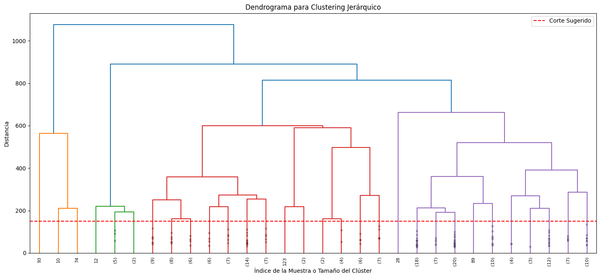
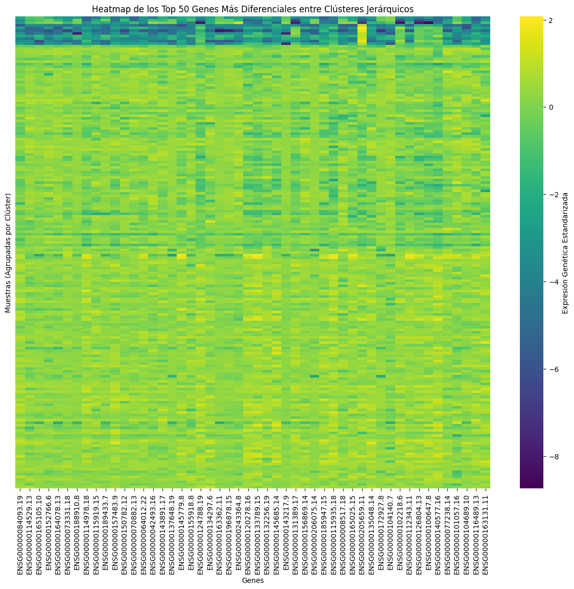

# 5. Clustering Jerárquico

[← K-Means](04_kmeans.md) | [Siguiente: Análisis de Genes →](06_analisis_genes.md)

---

## Introducción

El **Clustering Jerárquico** construye una jerarquía de clusters de forma aglomerativa (*bottom-up*): cada muestra comienza siendo su propio cluster y progresivamente se van fusionando los más similares hasta formar un único cluster global.

El resultado se visualiza mediante un **dendrograma**, que permite:
- Ver la estructura jerárquica completa de las fusiones.
- Determinar el número de clusters cortando el árbol a una altura determinada.

Se utilizaron los mismos 10 componentes principales (`pca_df_10`) que en K-Means para mantener comparabilidad.

---

## Dendrograma

Se utilizó el método de enlace **Ward**, que minimiza la varianza intra-cluster en cada fusión.

```python
from scipy.cluster.hierarchy import dendrogram, linkage

Z = linkage(pca_df_10, method='ward')

plt.figure(figsize=(15, 7))
plt.title('Dendrograma para Clustering Jerárquico')
plt.xlabel('Índice de la Muestra o Tamaño del Clúster')
plt.ylabel('Distancia')
dendrogram(
    Z,
    leaf_rotation=90.,
    leaf_font_size=8.,
    truncate_mode='lastp',
    p=30,
    show_contracted=True
)
plt.axhline(y=150, color='r', linestyle='--', label='Corte Sugerido')
plt.legend()
plt.tight_layout()
plt.show()
```

---



---

## Corte del Dendrograma y Asignación de Clusters

```python
from scipy.cluster.hierarchy import fcluster

# Corte a distancia 700 → produce 4 clusters
hierarchical_cluster_labels = fcluster(Z, t=700, criterion='distance')

print(f"Clusters identificados: {len(set(hierarchical_cluster_labels))}")

pca_df_10_hierarchical = pca_df_10.copy()
pca_df_10_hierarchical['cluster'] = hierarchical_cluster_labels

plt.figure(figsize=(10, 8))
sns.scatterplot(x='PC1', y='PC2', hue='cluster',
                palette='viridis', data=pca_df_10_hierarchical,
                legend='full', s=50, alpha=0.7)
plt.title('Clustering Jerárquico (PC1 vs PC2) — Corte a Distancia 700')
plt.xlabel('Principal Component 1')
plt.ylabel('Principal Component 2')
plt.grid(True, linestyle='--', alpha=0.7)
plt.legend(title='Clúster Jerárquico')
plt.tight_layout()
plt.show()
```

---


---

## Heatmap de Top 50 Genes Diferenciales (Jerárquico)

Con 4 clusters se utilizó **ANOVA de una vía** en lugar de la diferencia de medias simple (que solo aplica a 2 grupos), seleccionando los genes con el p-valor más bajo.

```python
from scipy.stats import f_oneway

tpm_with_hierarchical_clusters = tpm_scaled_df.copy()
tpm_with_hierarchical_clusters['cluster'] = hierarchical_cluster_labels

unique_hierarchical_clusters = sorted(tpm_with_hierarchical_clusters['cluster'].unique())

p_values = {}
for gene in tpm_with_hierarchical_clusters.columns.drop('cluster'):
    groups = [tpm_with_hierarchical_clusters[gene][tpm_with_hierarchical_clusters['cluster'] == c]
              for c in unique_hierarchical_clusters]
    if all(len(g) > 1 for g in groups):
        f_stat, p_val = f_oneway(*groups)
        p_values[gene] = p_val
    else:
        p_values[gene] = 1.0

p_values_series = pd.Series(p_values)
top_50_hierarchical_genes = p_values_series.nsmallest(50).index

# Heatmap
scaler_heatmap = StandardScaler()
X_scaled_hierarchical_top_genes = scaler_heatmap.fit_transform(
    tpm_with_hierarchical_clusters[top_50_hierarchical_genes]
)
X_scaled_df_hierarchical_top_genes = pd.DataFrame(
    X_scaled_hierarchical_top_genes,
    columns=top_50_hierarchical_genes,
    index=tpm_with_hierarchical_clusters.index
)
X_scaled_df_hierarchical_top_genes['Cluster'] = tpm_with_hierarchical_clusters['cluster']

X_heatmap_prep = X_scaled_df_hierarchical_top_genes.sort_values(by='Cluster').reset_index(drop=True)
heatmap_plot_data = X_heatmap_prep.drop(columns=['Cluster'])

plt.figure(figsize=(15, 12))
sns.heatmap(heatmap_plot_data, cmap='viridis', yticklabels=False,
            cbar_kws={'label': 'Expresión Genética Estandarizada'})
plt.title('Heatmap de los Top 50 Genes Más Diferenciales — Clusters Jerárquicos')
plt.xlabel('Genes')
plt.ylabel('Muestras (Agrupadas por Clúster)')
plt.show()
```



---

[← K-Means](04_kmeans.md) | [Siguiente: Análisis de Genes →](06_analisis_genes.md)
