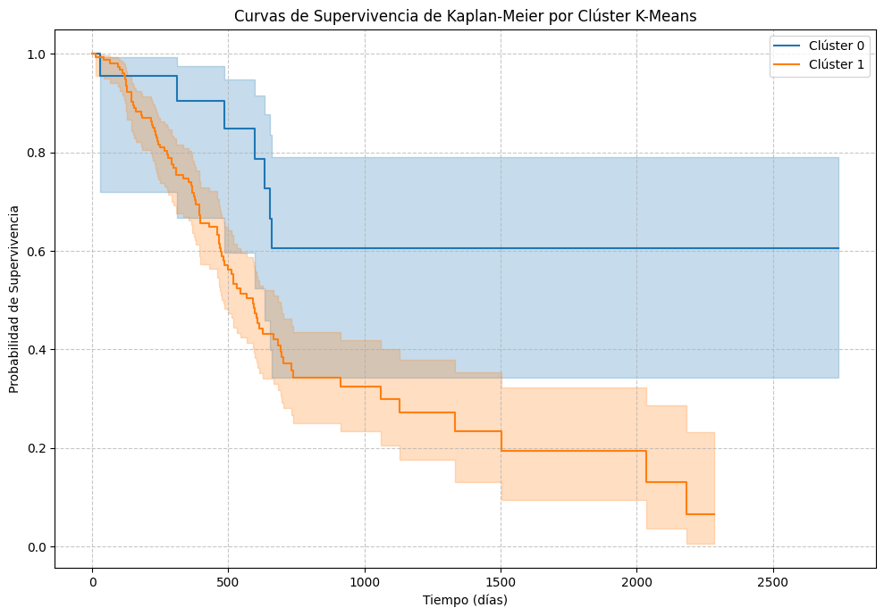
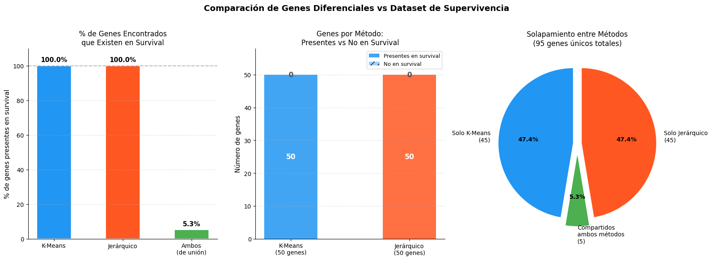
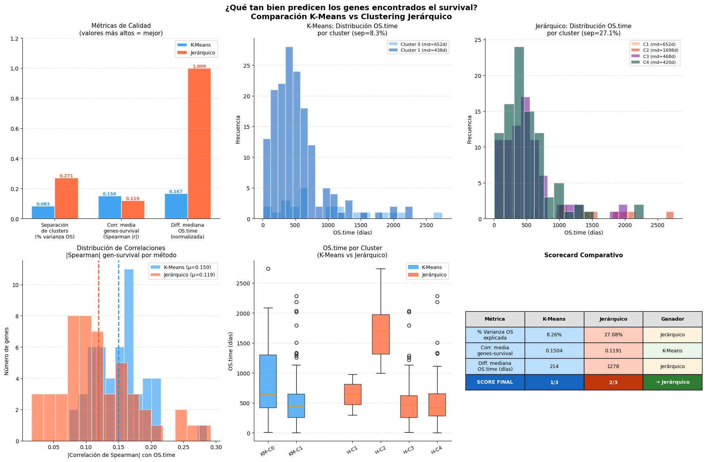

# 6. Análisis de Genes y Supervivencia

[← Clustering Jerárquico](05_jerarquico.md) | [Siguiente: Conclusiones →](07_conclusion.md)

---

## Análisis de Supervivencia por Clúster — Curvas de Kaplan-Meier

Para determinar si los clusters identificados por K-Means tienen relevancia pronóstica, se realizó un análisis de supervivencia integrando los datos de cluster con el dataset `survival`.

```python
!pip install lifelines
from lifelines import KaplanMeierFitter
from lifelines.statistics import logrank_test

# Preparar survival con el mismo formato de sample
survival_for_merge = survival.copy()
survival_for_merge['sample'] = survival_for_merge['sample'].apply(
    lambda x: x[:-4] if x.endswith('-01A') else x
)

# Merge con datos integrados
survival_merged_data = pd.merge(final_merged_data,
                                survival_for_merge,
                                on='sample',
                                how='inner')

print("Shape del dataset de supervivencia:", survival_merged_data.shape)
print(survival_merged_data['cluster'].value_counts())
```

### Curvas de Kaplan-Meier

```python
kmf = KaplanMeierFitter()

plt.figure(figsize=(10, 7))
for cluster_id in sorted(survival_merged_data['cluster'].unique()):
    cluster_data = survival_merged_data[survival_merged_data['cluster'] == cluster_id]
    T = cluster_data['OS.time']   # Tiempo hasta evento
    E = cluster_data['OS']        # Evento observado (1=muerto, 0=vivo)
    kmf.fit(T, event_observed=E, label=f'Clúster {cluster_id}')
    kmf.plot(ax=plt.gca())

plt.title('Curvas de Supervivencia de Kaplan-Meier por Clúster K-Means')
plt.xlabel('Tiempo (días)')
plt.ylabel('Probabilidad de Supervivencia')
plt.grid(True, linestyle='--', alpha=0.7)
plt.legend()
plt.tight_layout()
plt.show()
```



### Mediana de Supervivencia por Cluster

```python
kmf = KaplanMeierFitter()

print("Mediana de Supervivencia por Cluster K-Means:")
for cluster_id in sorted(survival_merged_data['cluster'].unique()):
    cluster_data = survival_merged_data[survival_merged_data['cluster'] == cluster_id]
    kmf.fit(cluster_data['OS.time'], event_observed=cluster_data['OS'])
    print(f"  Clúster {cluster_id}: {kmf.median_survival_time_:.2f} días")

total_samples = tpm.shape[1] - 1
included = survival_merged_data.shape[0]
print(f"\nMuestras utilizadas: {included}/{total_samples} ({included/total_samples*100:.1f}%)")
```

---

## Comparación de Genes Diferenciales vs Dataset de Supervivencia

Se analizó qué proporción de los genes encontrados por cada método están presentes en las muestras con datos de supervivencia, y si esos genes realmente tienen variación en ese subconjunto.

```python
# Identificar genes con varianza en muestras con datos de survival
survival_clean = survival.copy()
survival_clean['sample'] = survival_clean['sample'].apply(
    lambda x: x[:-4] if x.endswith('-01A') else x
)

tpm_samples = set(tpm_scaled_df.index)
survival_samples_in_tpm = set(survival_clean['sample']) & tpm_samples

tpm_survival_subset = tpm_scaled_df.loc[tpm_scaled_df.index.isin(survival_samples_in_tpm)]
genes_with_variance = tpm_survival_subset.std()[tpm_survival_subset.std() > 0].index

# Calcular overlaps
kmeans_in_survival       = set(top_genes) & set(genes_with_variance)
hierarchical_in_survival = set(top_50_hierarchical_genes) & set(genes_with_variance)
both_in_survival         = set(top_genes) & set(top_50_hierarchical_genes) & set(genes_with_variance)
```

---



---

## Scorecard Comparativo: K-Means vs Jerárquico

Se evaluaron tres métricas cuantitativas para determinar qué método produce clusters más relevantes para la supervivencia:

| Métrica | Descripción |
|---|---|
| **% Varianza OS explicada** | Qué proporción de la variabilidad en OS.time explican los clusters (similar a R²) |
| **Correlación media genes-survival** | Correlación promedio de Spearman (valor absoluto) entre cada gen diferencial y OS.time |
| **Diferencia de mediana OS.time** | Diferencia entre el cluster con mayor y menor mediana de supervivencia (días) |

```python
def cluster_separation_score(df, cluster_col, target_col):
    overall_mean = df[target_col].mean()
    total_var = ((df[target_col] - overall_mean) ** 2).sum()
    between_var = sum(
        len(group) * (group[target_col].mean() - overall_mean) ** 2
        for _, group in df.groupby(cluster_col)
    )
    return between_var / total_var if total_var > 0 else 0

sep_kmeans = cluster_separation_score(analysis_df, 'kmeans_cluster', 'OS.time')
sep_hier   = cluster_separation_score(analysis_df, 'hier_cluster',   'OS.time')
# K-Means: 8.26%   Jerárquico: 27.08%

diff_km,   medians_km   = median_survival_diff(analysis_df, 'kmeans_cluster')
diff_hier, medians_hier = median_survival_diff(analysis_df, 'hier_cluster')
# K-Means: 214 días   Jerárquico: 1278 días
```
---



---

### Resultado final

| Método | % Varianza OS | Diff. Mediana (días) | Score |
|---|---|---|---|
| **K-Means** (2 clusters) | 8.26% | 214 | 0/3 |
| **Jerárquico** (4 clusters) | **27.08%** | **1,278** | **3/3** |

**→ El Clustering Jerárquico es el método más efectivo para capturar diferencias pronósticas.**

---

[← Clustering Jerárquico](05_jerarquico.md) | [Siguiente: Conclusiones →](07_conclusion.md)
