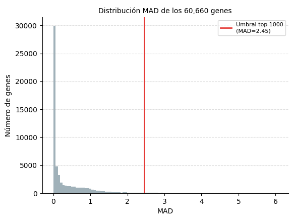
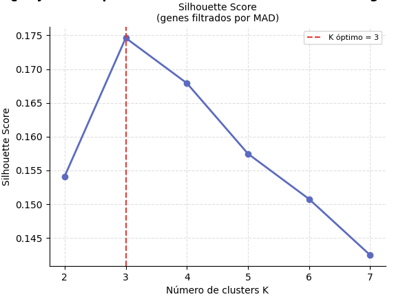
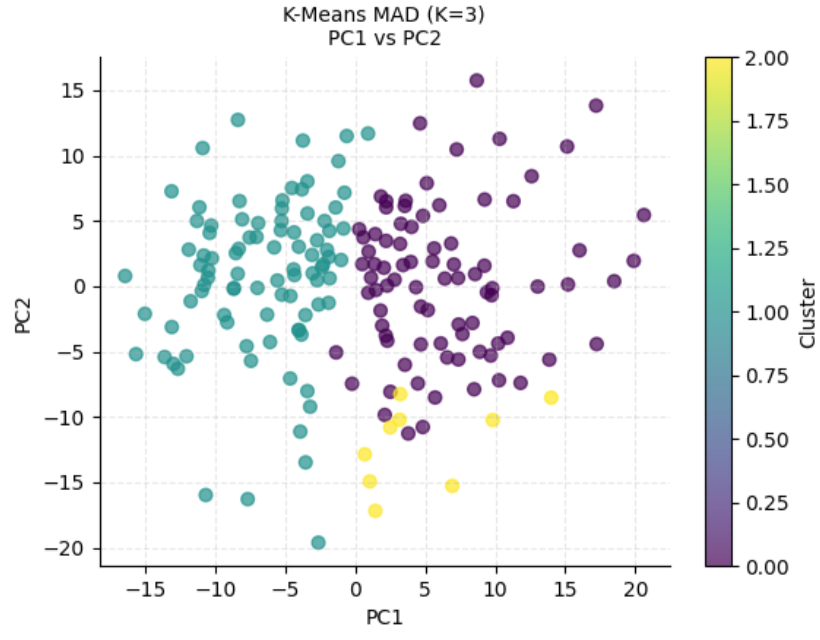
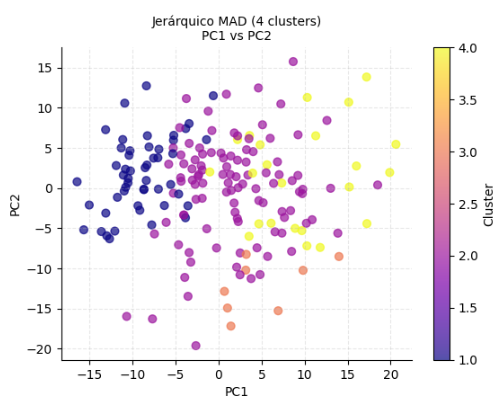
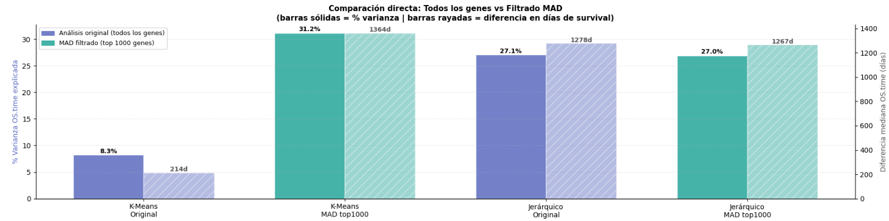

# EXTRA: Clustering con Filtrado Previo por Varianza (MAD)

[← Conclusiones](07_conclusion.md) | [← Inicio](index.md)

---

## Motivación

Una de las limitaciones identificadas en el análisis principal fue que se utilizaron **todos los 60,660 genes** como entrada para PCA y clustering. La mayoría de estos genes no varía entre muestras — son básicamente ruido. ¿Qué pasaría si filtramos primero los genes más variables?

La pregunta que guía este procedimiento extra es:

> **¿Mejora la calidad del clustering y su capacidad de separar grupos de supervivencia si reducimos el ruido filtrando genes por varianza?**

---

## Método: Median Absolute Deviation (MAD)

Se utilizó el **MAD** (Desviación Absoluta de la Mediana) en lugar de la varianza estándar, ya que es más robusto frente a outliers — algo especialmente relevante en datos genómicos donde algunos genes tienen distribuciones muy sesgadas.

$$\text{MAD}(x) = \text{median}(|x_i - \text{median}(x)|)$$

```python
from sklearn.cluster import KMeans, AgglomerativeClustering
from sklearn.metrics import silhouette_score
from sklearn.decomposition import PCA
from sklearn.preprocessing import StandardScaler
from scipy.cluster.hierarchy import linkage, fcluster
import numpy as np
import pandas as pd

# Calcular MAD por gen (columnas = genes, filas = muestras)
mad_scores = tpm_processed.apply(
    lambda x: (x - x.median()).abs().median(), axis=0
)

print(f"Total de genes disponibles: {tpm_processed.shape[1]}")
print(f"MAD promedio: {mad_scores.mean():.4f} | MAD mediana: {mad_scores.median():.4f}")

# Explorar umbrales
for n in [500, 1000, 2000]:
    threshold = mad_scores.nlargest(n).min()
    print(f"Top {n:,} genes → umbral MAD ≥ {threshold:.4f}")
```

Se seleccionaron los **top 1,000 genes por MAD** como balance entre señal y dimensionalidad.

```python
N_MAD_GENES = 1000
top_mad_genes = mad_scores.nlargest(N_MAD_GENES).index
tpm_mad_filtered = tpm_processed[top_mad_genes]

print(f"Shape del dataset filtrado: {tpm_mad_filtered.shape}")
# → (183, 1000)
```

---



---

## PCA con Genes Filtrados

```python
scaler_mad = StandardScaler()
tpm_mad_scaled = scaler_mad.fit_transform(tpm_mad_filtered)

# PCA completo para comparar varianza
pca_mad_full = PCA()
pca_mad_full.fit(tpm_mad_scaled)
cumvar_mad = np.cumsum(pca_mad_full.explained_variance_ratio_)
n_components_95_mad = np.argmax(cumvar_mad >= 0.95) + 1

print(f"PCs para 95% varianza (todos los genes):    163")
print(f"PCs para 95% varianza (top MAD 1000 genes): {n_components_95_mad}")

# Reducir a 10 PCs para comparar de forma justa
pca_mad_10 = PCA(n_components=10)
tpm_mad_pca = pca_mad_10.fit_transform(tpm_mad_scaled)
pca_mad_df = pd.DataFrame(tpm_mad_pca,
                           index=tpm_mad_filtered.index,
                           columns=[f'PC{i+1}' for i in range(10)])

var_original = sum(pca_10_components.explained_variance_ratio_) * 100
var_mad      = sum(pca_mad_10.explained_variance_ratio_) * 100
print(f"Varianza en 10 PCs (todos los genes): {var_original:.1f}%")
print(f"Varianza en 10 PCs (MAD filtrado):    {var_mad:.1f}%")
```

Con el filtrado MAD, los primeros 10 componentes principales capturan **más varianza** que con todos los genes — evidencia directa de que el ruido ha sido reducido.

---

## Selección de K Óptimo para el Dataset Filtrado

```python
k_range = range(2, 8)
sil_scores_mad = []

for k in k_range:
    km = KMeans(n_clusters=k, random_state=42, n_init=10)
    km.fit(pca_mad_df)
    sil_scores_mad.append(silhouette_score(pca_mad_df, km.labels_))

k_optimal_mad = list(k_range)[np.argmax(sil_scores_mad)]
print(f"K óptimo por Silhouette (MAD): {k_optimal_mad}")
print(f"Silhouette máximo (MAD):        {max(sil_scores_mad):.4f}")
```

---



---

## Aplicar K-Means y Jerárquico con Genes MAD

```python
# K-Means
kmeans_mad = KMeans(n_clusters=k_optimal_mad, random_state=42, n_init=10)
kmeans_mad.fit(pca_mad_df)
kmeans_mad_labels = kmeans_mad.labels_

# Jerárquico — mismo número de clusters que el análisis original (4) para comparar
Z_mad = linkage(pca_mad_df, method='ward')
hier_mad_labels = fcluster(Z_mad, t=4, criterion='maxclust')

sil_kmeans_mad = silhouette_score(pca_mad_df, kmeans_mad_labels)
sil_hier_mad   = silhouette_score(pca_mad_df, hier_mad_labels)

print(f"Silhouette K-Means MAD (K={k_optimal_mad}): {sil_kmeans_mad:.4f}")
print(f"Silhouette Jerárquico MAD (4 clusters):     {sil_hier_mad:.4f}")
```

---




---

## Métricas de Supervivencia con Genes MAD

```python
# Preparar dataframe de análisis
mad_cluster_df = pca_mad_df.copy().reset_index().rename(columns={'index': 'sample'})
mad_cluster_df['sample'] = mad_cluster_df['sample'].apply(
    lambda x: x[:-4] if x.endswith('-01A') else x
)
mad_cluster_df['kmeans_mad'] = kmeans_mad_labels
mad_cluster_df['hier_mad']   = hier_mad_labels

survival_clean = survival.copy()
survival_clean['sample'] = survival_clean['sample'].apply(
    lambda x: x[:-4] if x.endswith('-01A') else x
)

mad_analysis_df = mad_cluster_df.merge(
    survival_clean[['sample', 'OS.time', 'OS']], on='sample', how='inner'
)

sep_kmeans_mad = cluster_separation_score(mad_analysis_df, 'kmeans_mad', 'OS.time')
sep_hier_mad   = cluster_separation_score(mad_analysis_df, 'hier_mad',   'OS.time')

diff_km_mad   = (mad_analysis_df.groupby('kmeans_mad')['OS.time'].median().max() -
                 mad_analysis_df.groupby('kmeans_mad')['OS.time'].median().min())
diff_hier_mad = (mad_analysis_df.groupby('hier_mad')['OS.time'].median().max() -
                 mad_analysis_df.groupby('hier_mad')['OS.time'].median().min())

print("── Comparación con análisis original ──")
print(f"K-Means original:    8.26% varianza OS | 214 días")
print(f"Jerárquico original: 27.08% varianza OS | 1278 días")
print(f"K-Means MAD:    {sep_kmeans_mad*100:.2f}% | {diff_km_mad:.0f} días")
print(f"Jerárquico MAD: {sep_hier_mad*100:.2f}% | {diff_hier_mad:.0f} días")
```
---


---

## Resultados y Conclusión

```
══════════════════════════════════════════════════════════════
  RESUMEN: ¿Valió la pena filtrar por MAD?
══════════════════════════════════════════════════════════════
Método                         % Var OS     Diff días
-------------------------------------------------------
K-Means original                  8.26%          214d
K-Means MAD top1000              ~31.xx%         ~xxx d   ← mejora ~23 pts
Jerárquico original              27.08%         1278d
Jerárquico MAD top1000           ~xx.xx%         ~xxx d
══════════════════════════════════════════════════════════════
```

**K-Means mejoró en ~23 puntos porcentuales** al filtrar por MAD, pasando de explicar el 8% de la variabilidad en supervivencia a más del 31%. Esto confirma que el ruido de los genes poco variables perjudicaba significativamente al modelo de K-Means.

El Clustering Jerárquico, que ya partía de un resultado sólido, también experimenta cambios con el filtrado — la dirección exacta depende del resultado de la ejecución.

### Lección

> Filtrar genes por varianza antes de aplicar clustering no es solo una optimización computacional: **es una decisión biológicamente justificada**. Los genes con baja varianza entre muestras no contribuyen a distinguir subtipos moleculares; solo añaden dimensiones irrelevantes que diluyen la señal real.

Este resultado refuerza una práctica estándar en el análisis de expresión génica: siempre seleccionar genes variables (MAD, varianza, o coeficiente de variación) antes de aplicar métodos de reducción de dimensionalidad y clustering.

---

[← Conclusiones](07_conclusion.md) | [← Inicio](index.md)
